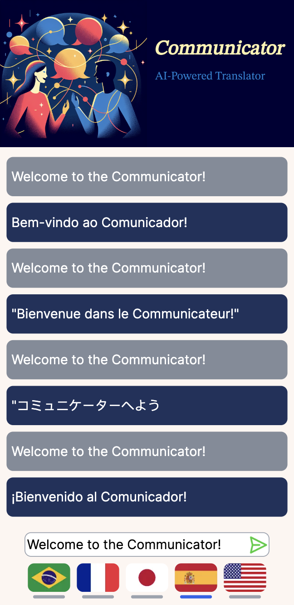

# Project: Communicator - AI-Powered Translator
## Description
This project is a translator that uses AI technology to translate between selected languages. Behind the scenes, OpenAI's LLM GPT models are used to perform the translations. I developed this project to gain experience with two technologies: OpenAI's API and the Next.js framework.

## Rational for the Project
Businesses and engineers started using Generative AI technologies to build products in many fields. Generative AI is an established technology with which we must be acquainted, enabling us to develop modern, easy-to-use products that enhance productivity. It includes actual physical products, not only apps. This project uses generative AI to identify the language of the original text and generate the translation to the target language.

Similarly, many professionals use the 'Next.JS' framework to develop Web applications. It claims the ability to allow quick prototyping apps and scale from there to production-grade infrastructure. Many web app frameworks come and go, and Next.JS might have the same fate. While they are 'hot' and productive, let's use it.

## Installation
1. Clone the repository
2. Install the required dependencies using the following command:
```bash
npm install
```
3. Start the development server using the following command:
```bash
npm run dev
```

## Usage
To use the translator:
- Simply select the target language
- Enter the text to be translated and click on the `Translate` button
- The translator shows your original text in the text area, followed by the translated text
- Repeat the process for more translations

## Reference design
Below is the UI reference design for this project:


